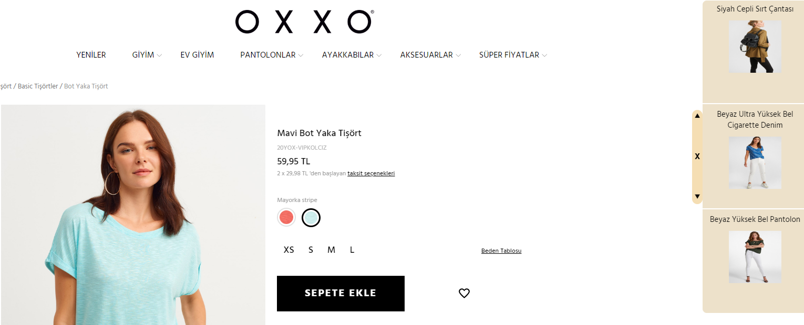
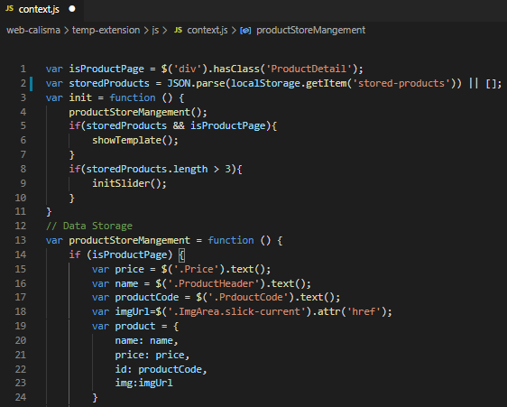

# Product Recommender
  Product-Recommender aims to store products in side-bar in order to present to user. Side-bar guides users to see what products they have lastly visited. Thus, instead of going through history to find products' link, they can easily reach in side-bar under favor of Product-Recommender.

# Contents
* [How to Use](https://github.com/ermanduran95/Product-Recommender/blob/erman-workspace/README.md#how-to-use)
  * [Using in oxxo.com](https://github.com/ermanduran95/Product-Recommender/blob/erman-workspace/README.md#Option:1-Using-in-oxxo.com)
  * [Customize the program](https://github.com/ermanduran95/Product-Recommender/blob/erman-workspace/README.md#Option:2-Customization)
* [Installing](https://github.com/ermanduran95/Product-Recommender/blob/erman-workspace/README.md#Installing)

# How to Use

## Option:1 Using-in-oxxo.com
  In order to develop the program www.oxxo.com.tr was taken as an example. Without any change program can be used in the website after [installation](https://github.com/ermanduran95/Product-Recommender/blob/erman-workspace/README.md#Installing).

## Option:2 Customization
  Since program have been developed by using oxxo.com.tr's parameters, It will not be able to work in other website unless it is customized. There are some parameters that need to be changed.Below steps illustrate how to customize it for the e-commerce website that you would like to use it in.
  * Step-1 [install](https://github.com/ermanduran95/Product-Recommender/blob/erman-workspace/README.md#Installing) the program.
  * Step-2 Open the file in your editor and change the parameters shown below
    * line 1 $('div').hasClass('ProductDetail') targets the div element that has productDetails class to initiate the program. Alter the element and hasClass parameters according to the website's html that you want to implement.
    * line 15, 16, 17, 18 obtains the products' information such as price, name, id, img. Alter the targeted class "$('.Price'), $('.ProductHeader'), $('.PrdouctCode'), $('.ImgArea.slick-current')" with unique class.
  
  
# Installing
* Download zip file
* Export zip into a new file
* Open Chrome and type into search chrome://extensions 
* Enable developer mode
* Click "load unpacked" button
* Choose the file that you exported the downloaded files

When you follow the instructures in order you will be able to use extention. Enjoy the program! :)
